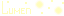

<br>
<br>
<br>

<em>
Екатерина Семчук<br>
Мария Блинова<br>
Артём Сон<br>
</em>

## Об игре


Вы играете за сгусток света по имени Люмен. Ваша цель - рассеять все тени, которые будут появляться на вашем пути. В этом вам помогут люминисцентные грибочки, которые вы найдете по пути.<br>
<br>
<em>_Удачи!_</em>

### Основная цель

- Рассеять все тени на уровне
- После очистки уровня появляется выход
- Достигнув выхода, игрок переходит в следующую комнату

### Система боя

- У игрока есть зона свечения вокруг персонажа
- Атака происходит автоматически при нахождении тени в зоне свечения
- Если тень касается игрока - она наносит урон
- После получения урона тень впадает в панику и хаотично движется несколько секунд

## Управление


- **Стрелочки** ← → ↑ ↓ - перемещение персонажа
- **Q, W, E** - использование грибов

## Система опыта


### Опыт и уровни

- Опыт накапливается за убийство мобов
- При достижении порога опыта:
    - Уровень игрока повышается
    - Требуемый опыт для следующего уровня увеличивается
    - Параметры персонажа улучшаются
    - Накопленный опыт сбрасывается

### Характеристики

| Параметр | Описание                   |
| -------- | -------------------------- |
| Атака    | Урон по мобам              |
| Защита   | Снижение получаемого урона |
| Здоровье | Запас прочности            |

## Бонусная система


Во время прохождения уровня вы собираете **люминисцентные грибы** трех видов, использование каждого из которых дает временные усиления характеристик:

- Бонус к атаке
- Бонус к защите
- Длительность эффекта

## Мобы


В игре вам также встретятся **тени**:

- всего три вида с разным поведением: агрессивное, пассивное и равнодушное
- после получения урона тени впадают в панику и начинают хаотично метаться по карте на высокой скорости
- атакуют только при прямом контакте

## Запуск игры

```bash
npm ci # to install dependencies
npm start # starts localhost:8000 server
```

## Запуск тестов

```bash
npm test
```

## Форматирование

```bash
npm run format
```
